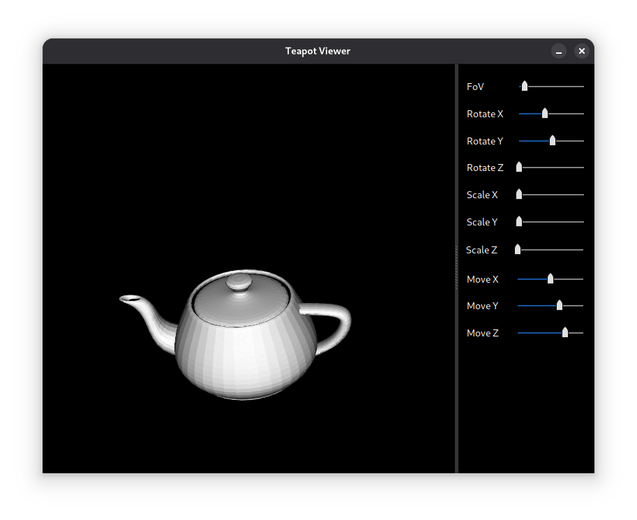

# Xform3D package for U++

**Xform3D** is a software-based, lightweight 3D transformation library for U++, focused on providing essential matrix math and geometric tools for 3D graphics applications. It includes a templated 4×4 matrix class and basic support for 3D point manipulation, with a design optimized for row-major, left-handed coordinate systems.

## Features

- **Templated Matrix Class (`Matrix4_`):**    A generic 4×4 matrix supporting translation, scaling, rotation (axis-aligned), perspective, and frustum projection.

- **Row-Major Layout with Left-Handed Coordinates:** Matches typical 3D rendering setups for clarity and compatibility.

- **Basic 3D Geometry (`Point3_`, `Point4_`, `Box3_`):** Simple 3D point/vector classes with support for `Null` value handling and homogeneous coordinates.

## Examples

| **Name**         | **Description**                                                                  |
|:-----------------|:---------------------------------------------------------------------------------|
| `Teapot3D`       |  Example code rendering the famous Utah teapot model, using Xform3D and Painter. |

## Screenshot

